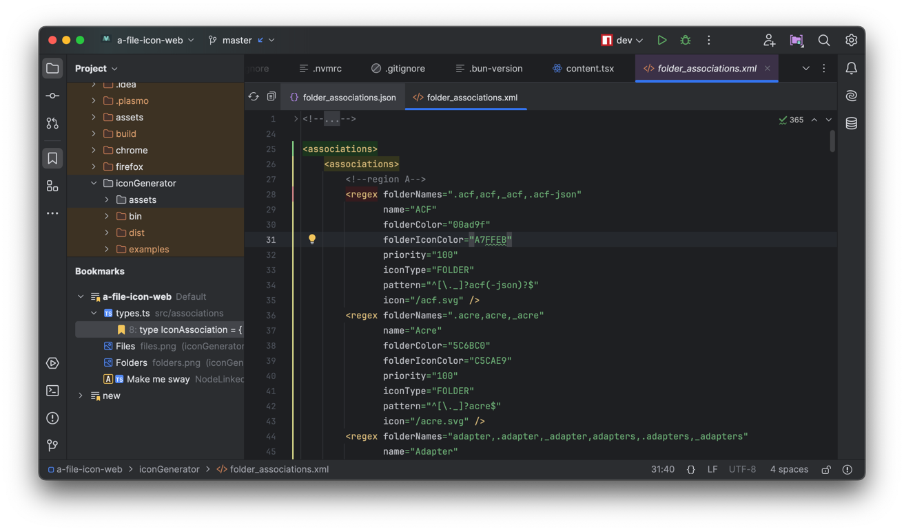
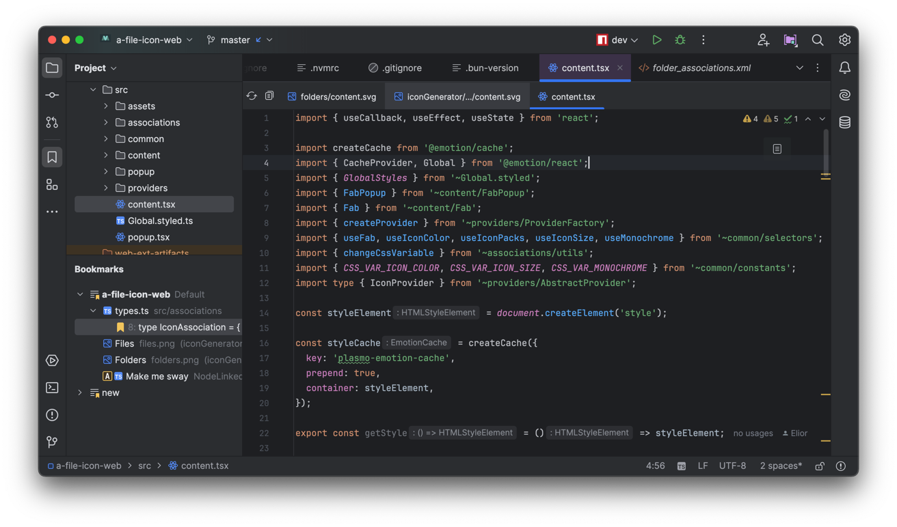
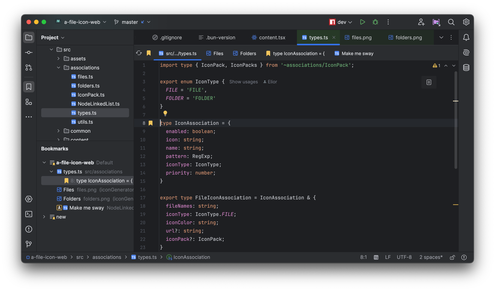
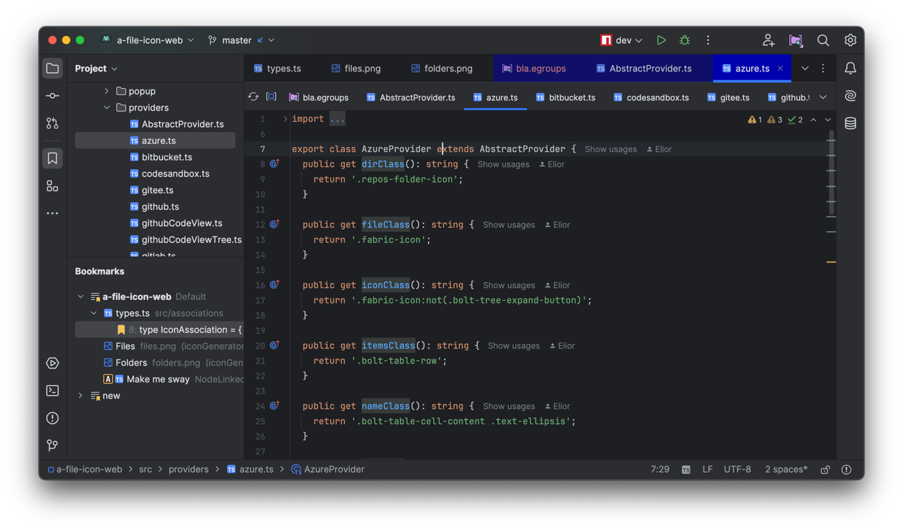
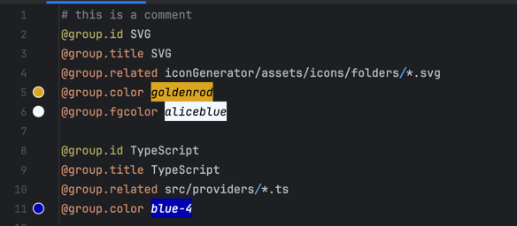
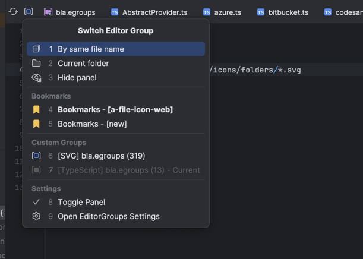
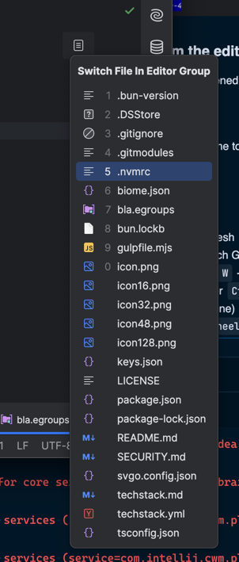
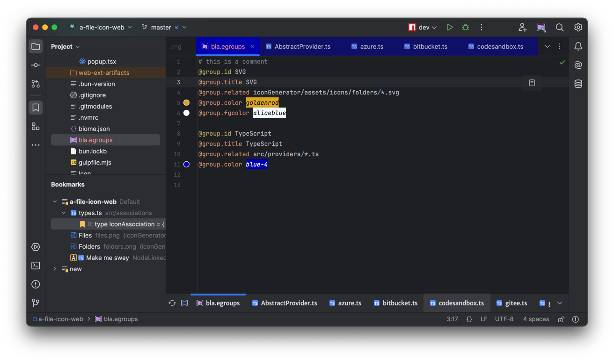
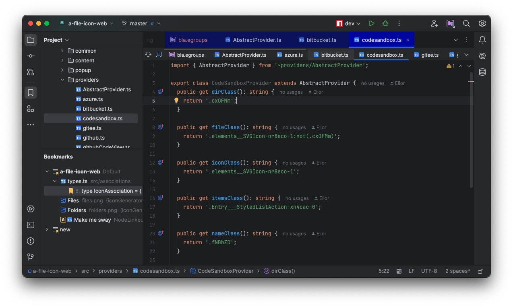
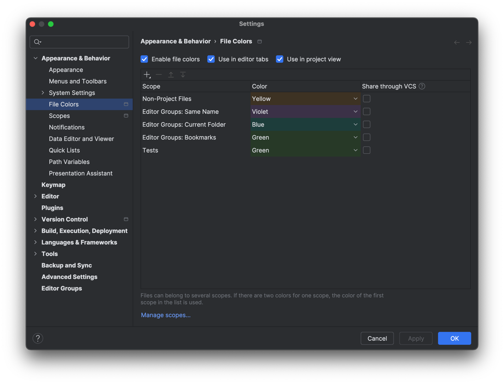

# Editor Groups

Add an additional tab panel for files belonging to the same logic group.

This is an implementation of <https://github.com/SomewhatCloudy/phpstorm-related-proposal>

## Features

### Group by File Name

Displays all files with the same name (without extension) in the project.

### Group by Folder

Displays all files in the same folder.

### Group by Bookmarked Files

Show all files and line bookmarks from your bookmark groups.

### Group by Regex (Advanced)

Define regex groups and group all files matching the regex.

### Custom Groups

Define your own groups in `.egroups` files, that you can share and modify at your guise.

The plugin comes with it's own language support for `.egroups` files:

- Easily create new `egroups` files from the menu
- Syntax highlighting
- Code completion
- Color preview
- Customizable colors

### Group Switcher

Quickly switch between groups using the group switcher.

### Switch current opened file

You can switch the current opened file with another file from the same group

- From the tab panel
- From the inline popup at the top right

You can also open the file in a new tab, window, or split window:

- `Ctrl + Click` - open a file in a new tab
- `Shift + Click` - open a file in a new window
- `Alt + Click` - open a file in a vertical split window
- `Alt + Shift + Click` - open a file in a horizontal split window

### Shortcuts

- `Ctrl + Alt + Q` - Refresh
- `Ctrl + Alt + W` - Switch Group popup
- `Ctrl + Alt + Shift + W` - Switch File popup

- `Ctrl + Mouse Wheel` or `Ctrl + ; or '`  - switch file (closing the previous one)
- `Ctrl + Alt + Mouse Wheel` or `Ctrl + Alt + ; or '` - switch file (leaving the previous one opened)
- `Ctrl + Shift + Mouse Wheel` - switch file into a new window

----

### Settings

The plugin includes a vast choice of settings to customize the behavior, performance and appearance of the plugin.

You can enter the settings either by looking for `Editor Groups` in the settings search bar, or by right clicking on the panel and selecting
`Open Editor Groups Settings`.

### Global

- **Show Tabs Panel**: Whether to disable the tabs panel globally

### Behavior

#### Fallback behavior

By default, the plugin will try to match the best suited group for the current file:

- If it belongs to a custom group
- If it belongs to a bookmark group

If no match is found, it will fall back to the following cases, in this order:

* Fallback to "Regex Group": Will try to match to one of the defined _Regex Groups_
* Fallback to "Same Name" group: Will try to match all files with the same name (without extension)
* Fallback to "Current Folder" group: Will try to match all files within the same folder

If no match is found (e.g. there is only one file in this group, the current file), then it will execute the following check:

* If **Hide Panel If Empty** is enabled, the panel will be hidden
* Otherwise it will display the current file

#### Force Switch to a Custom Group

You can force the plugin to automatically switch to a defined custom group by pressing the *Refresh* button,
without having to select the custom group manually.

This can be useful when designing custom groups, to make sure that files are matched correctly.

#### Remember Last Group

When enabled, the plugin will keep in memory the last selected group for each opened file.

----

### Appearance

#### Tabs Position

You can customize the position of the tab panel (`TOP` or `BOTTOM`)

#### Custom Font

You can change the font of the tabs.

#### Display Group Size

Displays the size of the group for custom groups

#### Compact Tabs

Reduce the size of the tabs.

#### Colorize Tabs

With this setting, opened tabs belonging to the same group will be reflected in the main tab panel. This is useful to get a quick glance of
all the related opened tabs for quicker switching.

Note: The default groups (`Same Name`, `Current Folder`, `Bookmarks`) have their own predefined color that you can customize in the _File
Colors Settings_.

----

### Performance

You can also improve the performance of the plugins with the following options

### Exclude *.egroups files

Exclude the custom groups from the list of available groups. This can be useful if you have a lot of groups or if you don't plan to use the
custom groups feature, without having to delete the `*.egroups` files.

### Index *.egroups files only

On the contrary, you can decide to only use the custom groups and ignore the default, bookmarks and regex groups.

### Initialize groups synchronously

By default, the plugin will match files belonging to the same group asynchronously, which results in showing a "Loading..." pane until all
files are indexed. You can disable this behavior to show the files immediately.

### Group Size Limit

The maximum number of files that can be matched within a group. If the group size exceeds this limit, the group will not be displayed.

### Tab Limit

The maximum number of tabs that can be displayed in the tab panel. If the number of tabs exceeds this limit, the exceeding tabs will not be
displayed.

----

## Custom Groups Syntax

You can define your own groups in `.egroups` files using a custom syntax provided by the plugin.

These files should contain a list of groups separated by one or more blank lines.

### Rules

- Each group should have an **ID**: `@group.id myUniqueId`
- A group might have a **root directory**: `@group.root .*`. If unspecified, the root directory of the project will be used.
- A group must have a **title**. It will be displayed in the _Group Switcher_.
- A group must have a **path pattern** for the related files: `@group.related .*/*.svg`
  - A path is relative to the root
  - It can contain absolute and relative paths
  - It must be a regex
  - You can use macros like `MODULE`, `PROJECT` to reference respectively the current module or the project root
  - It does not support globs yet
- A group can have both a **color** and **fgcolor** to give them a custom background and foreground color:
  - `@group.color #FF0096`
  - `@group.fgcolor #FFFFFF`
  - You can preview the color directly in the file
  - You can enter a hex color in the forms: #123, #123456 or #12345600
  - You can also use a color from a predefined list of colors by invoking the autocompletion
- A group can be **disabled**: `@group.disable`

Please note that this is a very naive implementation of a custom language. It does not have any error checking or validation, so be careful
when editing these files.

### Examples

#### Relative paths to the current file

- `@group.related file.txt`
- `@group.related ../file.txt`

#### Absolute paths

- `@group.related C:/file.txt`
- `@group.related /file.txt`

#### Macros

- `@group.related MODULE/src/file.txt`
- `@group.related PROJECT/myModule/src/file.txt`

#### Wildcards

- `@group.related ./*`
- `@group.related *.txt`
- `@group.related file.*`
- `@group.related f??e.txt`
- `@group.related fileName` (with all extensions, unless the file exists)

#### Exact filename anywhere in the project

- `@group.related */foo/file.txt`

#### All files with the same name anywhere in the project

- `@group.related \*/foo/file.*`

#### Tab/Title customization

- `@group.title yourTitle`
- `@group.color yellow` (a name from https://www.w3schools.com/colors/colors_names.asp)
- `@group.color yellow+3` (or yellow+++ or yellow-3 or yellow--- for darker or brighter shade)
- `@group.color #FF0096`
- `@group.color 0xFF0096`

#### Disable group

- `@group.disable` (disables indexing of the current file)
